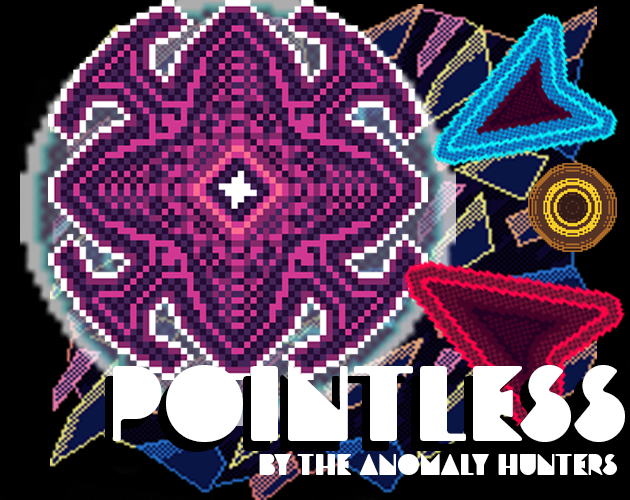

# Pointless
 

Made for the 2026 GMTK Game Jam by the Anomaly Hunters

## About

Pointless is a 2d top-down action game about a triangle making his way through a world that is corrupting (after the person playing it spilled water on his PC). Movement switches between a dash mode and a bounce mode while a countdown to full corruption runs in the background, and every hit costs seconds.

Custom abilities like Poly Spikes, Blink Dash, Chain Kill and Stun Save each carry their own cooldowns and charges. Three can be equipped at a time, dragged from the inventory in the pause menu into the active slots on the HUD. The final boss strips that loadout out and hands over three overpowered abilities instead, which toggle on and off and combine into a super mode.

Play it here: https://thebuiifrog.itch.io/pointless

## Members:
in alphabetical order

@asier

@gamingwithjulesk

@ghurt

@moovintwo

@randompigion (Aahil Ahsan)

@robopugo

@ruppie (Ruppie09)

@ryder (Ryder Kao)

@syntax (Thinaphat Sooksri)

@thebullfrog2970 (Jeremiah Hollingsworth)

@tgs2401

@yuleedev (Yulee Oh)
